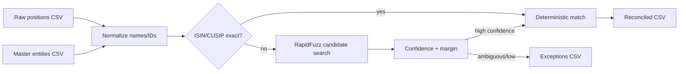

# Entity Matching & Data Reconciliation Engine

An explainable entity-resolution pipeline for matching messy fund and security names to a controlled master table. It uses deterministic ISIN/CUSIP checks first, then `rapidfuzz` name similarity, and produces a manual-review exceptions report instead of silently forcing weak matches.

## Problem

Operational investment data often contains spelling differences, punctuation, legal suffixes, abbreviations, stale identifiers, and inconsistent security names. A reliable reconciliation process should be deterministic when an identifier agrees and transparent when it does not.

## Data flow



## Matching strategy

1. Normalize whitespace, punctuation, Unicode, legal suffixes and case.
2. Exact ISIN match gets the strongest evidence.
3. Exact CUSIP match is used when ISIN is absent.
4. Otherwise score name similarity using `rapidfuzz.fuzz.WRatio`.
5. Require both a minimum score and a minimum gap over the runner-up.
6. Emit `MATCHED`, `REVIEW`, or `UNMATCHED` with reason codes.

The output records the method, score, runner-up and reason so a reviewer can audit each decision.

## Setup

```bash
python3 -m venv .venv
source .venv/bin/activate
pip install -e '.[test]'
pytest -q
```

## Run

```bash
entity-match \
  --master examples/master.csv \
  --input examples/raw_positions.csv \
  --output output/reconciled.csv \
  --exceptions output/exceptions.csv
```

## Sample output

`reconciled.csv` contains matched entities, matching method, confidence score and status. `exceptions.csv` contains low-confidence or ambiguous records with the top candidate and score gap.

## Production considerations

- Keep master-data changes versioned.
- Review all exceptions before downstream booking/reporting.
- Do not treat a name score as proof of identity.
- Prefer stable identifiers and maintain identifier history.
- Monitor false-positive and false-negative rates by source.

## Project structure

```text
src/entity_reconciliation/
  normalize.py
  matcher.py
  cli.py
tests/
examples/
```
